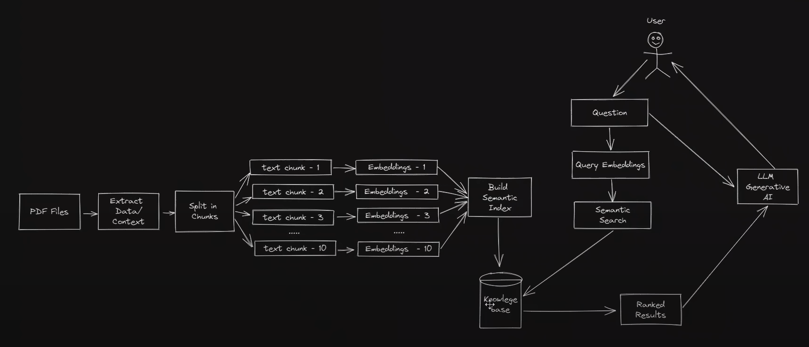

# Language Chain Project 📚🤖

Welcome to the Language Chain Project, a robust tool for analyzing and extracting information from medical literature, specifically focused on chest pneumonia.
<br/>
<center>

</center>
<br/>
## Prerequisites 🚀

Ensure you have the required packages installed by running:

```bash
pip install -r requirements.txt
```

## Installation and Setup 🛠️

1. **Load Environment Variables from .env 📥**

- `OPENAI_API_KEY`: Your OpenAI API key. You can get one [here](https://beta.openai.com/).
- ```python
   from dotenv import load_dotenv

   load_dotenv()
   ```

1. **Load Documents 📚**

   ```python
   from langchain.document_loaders import PyPDFLoader

   documents = PyPDFLoader('documents/book_01.pdf').load()
   ```

2. **Preprocess Documents & Create Chunks 📝**

   ```python
   from langchain.text_splitter import CharacterTextSplitter

   chunks = CharacterTextSplitter(chunk_size=1000, chunk_overlap=0).split_documents(documents)
   ```

3. **Create Embeddings 📐**

   ```python
   from langchain.embeddings.openai import OpenAIEmbeddings

   embeddings = OpenAIEmbeddings()
   ```

4. **Initialize The Database 🗄️**

   ```python
   from langchain.vectorstores import Chroma

   database = Chroma.from_documents(chunks, embeddings)
   ```

5. **Create The Retriever 🧲**

   ```python
   retriever = database.as_retriever(search_type='similarity', search_kwargs={'k': 3})
   ```

6. **Import The LLM Model 🤖**

   ```python
   from langchain.llms.openai import OpenAI

   llm = OpenAI()
   ```

7. **Build Your Chain 📜**

   ```python
   from langchain.chains import RetrievalQA

   qa = RetrievalQA.from_chain_type(
       llm=llm,
       chain_type='stuff',
       retriever=retriever,
       return_source_documents=True,
   )
   ```

## Usage 🧪

Now, you're ready to test the system! Use the following functions to ask questions related to chest pneumonia:

```python
ask('What are the symptoms of pneumonia?')
ask('How to treat pneumonia?')
ask('What is the most common cause of pneumonia?')
ask('What is the fatality rate of pneumonia?')
ask('What is the rate of tuberculosis?')
```


## Contributors 👥

- Majid Saleh Al-Raimi
- Alwaleed Ahmad Al-Qurashi
- Mahmoud Sahal Noor
- Rashid Sami Al-Binali
- Abdulrahman Sami Al-Juhani
- Mashari Adel Al-Jiban


## License 📄

This project is licensed under the MIT License - see the [LICENSE.md](LICENSE.md) file for details.


Feel free to explore and customize the questions to suit your needs. Happy coding! 🚀🤓
